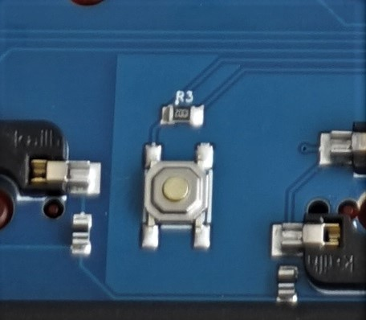

# ✨⌨ CU65 guide - Entering DFU (Device Firmware Upgrade) mode

**Remember that this mode will persist until firmware is flashed or keyboard power is cycled unless no firmware is present.**

There are several ways available based on your current firmware.

## Stock firmware
 - Use [Hardware Reset](#hardware-reset).

## VIA Firmware

 - If the keyboard is functional, `FN + ESC` will reboot into DFU mode.
 - If not use the [Bootmagic](#bootmagic-firmware) method.

## Bootmagic Firmware

1) Disconnect the USB from the keyboard.
2) Reconnect the USB cable while holding ESC on the keyboard.

## Hardware Reset

1) Remove the backplate.
2) Plug in the keyboard.
3) Press the physical reset button on the back of the PCB

 