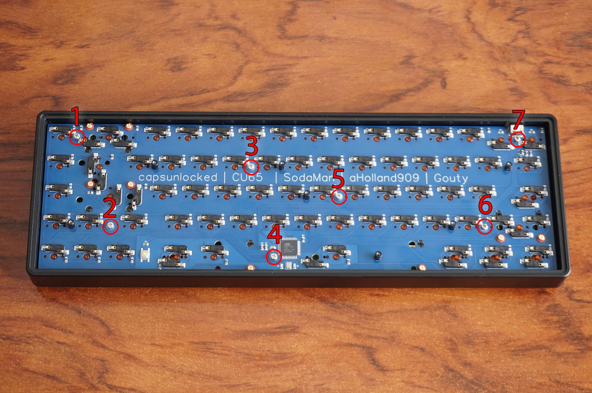

# ✨⌨ CU65 guide - Keyboard mount

## Content of the package
 - 10 flat screws
 - 10 round screws
 - 3 big screws
 -  About 17 washers
 - Back Case
 - Front Case
 - Foam layer
 - PCB
 - Footbar
 - 2 Foot stickers

## What do you need?
### Common for any layout
- USB C cable.
- A star screwdriver.
- A 2.5mm hex key.
- (Optional) Some lube for switch keys and stabs like Krytox 205G0 or Trybosys 3204.
### For ISO layout
- 6.25u or 7u Stab for spacebar.
- 2u stab for Backspace.
- 2u stab for Enter key.
- About 68 Switch keys.
### For ANSI layout
- 6.25u or 7u Stab for spacebar.
- 2u stab for Backspace.
- 2u stab for Enter key.
- 2u stab for Left Shift key.
- About 67 Switch keys.

## Mount guide
- Put off the back case and the white foam.
- Put off the PCB, is very tight. I suggest push from opposite side of the USB side, where are going to be the Ins, Del, PgUp, PgDn keys. When you put off the PCB from this tight stand off is much easy to get it.
- I suggest to connect the PCB to your PC and flash VIA Firmware. You can follow the instructions from the chapter for flash guide.
- Now you can test Hotswap switches connections with some tweezers or a clip and with the key tester of VIA(if yopu flashed it) or some software like EK Switch Hitter.
- Its time to put and screw the stabs.
- Now you can put the PCB on the front case. Put in its place first the USB C connector and the and the align the holes for the standoffs.
- Now you can put your stabs switches from the front case. I suggest you to hold the hotswap socket when you push the switch so as not to break them.
- Put some keycaps to the stabs and **test them before put all the switch keys** .
- Now you can put the rest of your favourites switches from the front case. Remember to hold the hotswap socket when you push the switch so as not to break them.
- Use 7 rounded screws and washers to screw the PCB to thev front case. At this image you cand found where is the holes for this screws.

- You can test again the switches.
- Screw the footbar to the back case with the 3 big screws.
- Put the foam layer and the back case. And screw the back case to the front case with 7 flat screws.
- (Optional)Use your 2 foam stickers, one at the back case and other to the footbar.
- Finally put your favourite keycaps to your switches and enjoy your CU65 Keyboard.