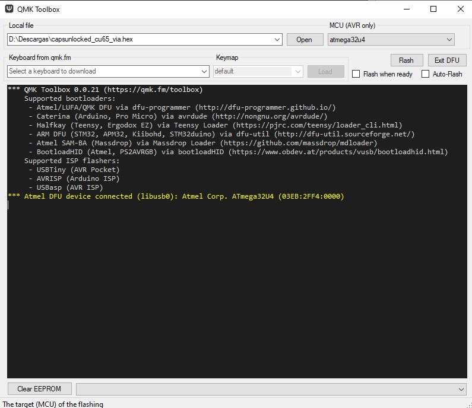
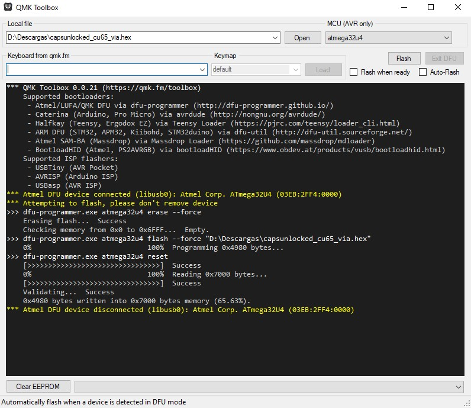
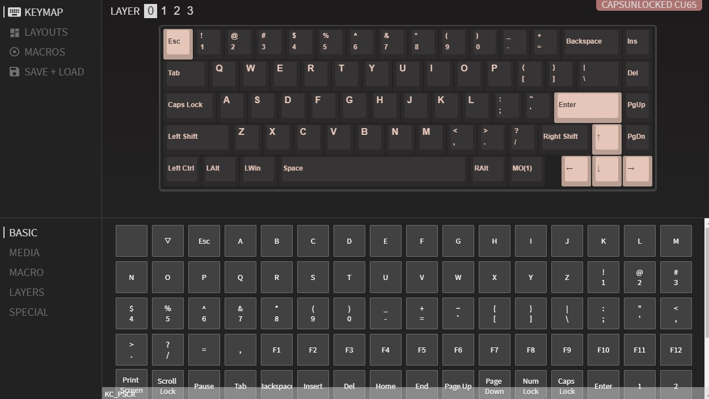

# ✨⌨ CU65 guide

This is a modified version of [xarly06's CU65 guide](https://github.com/xarly06/cu65-guide) to serve my needs ¯\\\_(ツ)_/¯. My keyboard is already mounted (and is ♥LOVELY♥), so I'm just referencing this to check how to flash new layouts.

[Check the instructions to mount the keyboard here!](./Keyboard%20mount.md)

## Let's get FLASHY ✨

### Software options

There are two ways to flash your keyboard:
1) **With [QMK Toolbox](#qmk-toolbox).**
2) **With [VIA](#via).** I have had no luck with this option as it doesn't detect my keyboard 😢. Might have something to do with me using Linux... Supossedly _"you will need to flash it only once and you can change the keyboard layout without flashing it"_.

### Creating layouts

You can make your own layout with [QMK Configurator](https://config.qmk.fm/#/) and save it as a `.json` file. You can later on import it to make changes or create new layouts. But beware! You **cannot** flash the `.json`! **You need your layout as an `.hex` file!** To create it, compile your layout on [QMK Configurator](https://config.qmk.fm/#/) and click on `Firmware` to download it.

## QMK Toolbox

If you don't have it already, install [QMK Toolbox](https://github.com/qmk/qmk_toolbox/releases). Open it and it will install some USB drivers you will need.

### Getting ready to flash

- Connect your keyboard.
- Launch QMK Toolbox.
- Select the firmware to flash: in QMK Toolbox select `Open`, navigate to your `.hex` file and click open.
- [Enter DFU (device firmware upgrade) mode](./DFU.md). **This mode will persist until firmware is flashed or keyboard power is cycled unless no firmware is present.**
- Verify that you are in **Bootloader Mode**. If you have successfully entered bootloader mode, the keyboard should disconnect and reconnect (you may hear a sound in windows). Shortly after re-connecting you should see a yellow line appear in your QMK Toolbox window as per the image below. If you have a different message check out the [Zadig](https://docs.qmk.fm/#/driver_installation_zadig) troubleshooting steps on the QMK site. **For MacOS users you may have to tick the "Auto Flash Firmware" button for the device to be detected by QMK Toolkit!**

### Flashing the firmware

Click `Flash`! On completion the keyboard should disconnect and begin <u>functioning</u> as per its new firmware.

At QMK Toolbox you will see something like this if all went OK.

### Clearing the EEPROM

If you're having any weird issues with any firmware you try, especially VIA-based firmwares, it's recommended that you clear the EEPROM. They store their configuration in spare EEPROM space, so clearing it will let the board start from a known good place so you can set it up again. Use the `Clear EEPROM` button in the bottom left of the QMK Toolbox window to do that, then flash the firmware again straight afterwards as Toolbox asks you to!

## VIA

If you don't have it already, install [VIA](https://github.com/the-via/releases/releases/latest).

*You may also need to install [QMK Toolbox](https://github.com/qmk/qmk_toolbox/releases) and open it to get some USB drivers... I didn't understand clearly the original instructions.*

### Basic configuration (like real basic)

- Launch VIA.
- Once your keyboard has been detected in VIA, you should be presented with the following screen.

From here you can edit most functions of the keyboard from creating macros to rebinding layers. You can edit any key clicking on it on the top keyboard image and then click the new key value from the bottom section. From the left Layout section you can edit your layout to use ISO or ANSI layout.